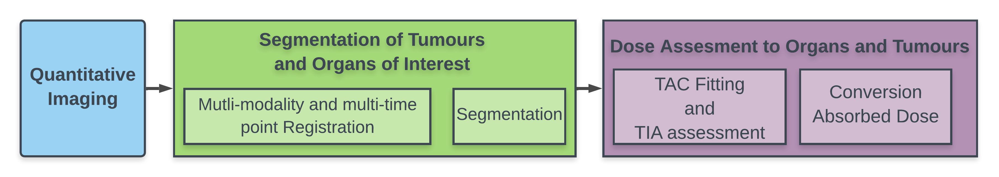

.. _intro-overview:

==========================
Pytheranostics at a glance
==========================

PyTheranostics is a library of tools to process nuclear medicine scans and take them through the dosimetry workflow to calculate the absorbed dose in target organs. The library is designed to be modular and extensible, so that new features can be added easily.

   The dosimetry workflow involves quantitative imaging, followed by segmentation of volumes of interest, and finally the calculation of absorbed dose in target organs.

